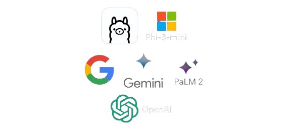

<h1 align="center">SyncRAG</h1>

    

  Progetto di stage presso Sync Lab S.r.l.
     
     
  Applicazione web per interagire con un chatbot allenato sui tuoi documenti
     
  Retrieval-Augmented Generation con LangChain4J
     
  Large Language Model Phi-3 mini, GPT 3.5 Turbo, Gemini 1.5 Pro e PaLM 2 Bison
     
  Sviluppato con Java Spring e React

  

    

<h3 align="center">Come utilizzare</h3>

    Per configurare e utilizzare il prototipo, fare riferimento al documento Proof_of_Concept.pdf
     
    Consultare il medesimo documento per maggiori informazioni sul funzionamento del prototipo

<h3 align="center">L'applicazione</h3>

    

    

    Scegli quale modello linguistico utilizzare tra Phi-3, GPT 3.5 Turbo, Gemini 1.5 Pro e PaLM 2 Bison
     
    Invia una domanda al chatbot, e ricevi risposte relative alle sole infromazioni contenute nel database
     
    Visualizza, aggiungi e rimuovi documenti dal database vettoriale dell'applicazione (solo per l'Amministratore)

